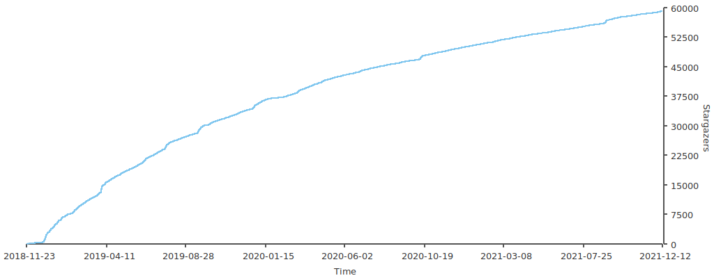

# Internet Java Engineer Advanced Knowledge Complete Literacy

Most of the content of this project comes from China Huperg, the copyright belongs to the author, and the content covers [High Concurrency] (#高 Concurrency Architecture), [Distributed] (# Distributed System), [High Availability] (#高用建筑), [Microservice](#微服务结构), [Massive data processing](#Massive data processing) and other domain knowledge. I have done a systematic sorting out of this part of knowledge to facilitate learning and reference.

Discussions function has been activated for this project. Before learning, let’s take a look at what the technical interviewers at [Discussions Discussion Forum](https://github.com/doocs/advanced-java/discussions/9) say. This project welcomes all developers and friends to the Discussions forum to share some of their thoughts and practical experience. You may also wish to follow Star [doocs/advanced-java](https://github.com/doocs/advanced-java) to keep track of the latest developments in the project.

This project is built based on Docsify and uses the open source gadget [Gitee Pages Action](https://github.com/yanglbme/gitee-pages-action) to automatically deploy and update the site. Currently supports the following three site visits:

-Netlify: https://adjava.netlify.app
-Gitee Pages: https://doocs.gitee.io/advanced-java
-GitHub Pages: https://doocs.github.io/advanced-java

## High Concurrency Architecture

### [Message Queuing](./docs/high-concurrency/mq-interview.md)

-[Why use message queues? What are the advantages and disadvantages of message queues? What are the advantages and disadvantages of Kafka, ActiveMQ, RabbitMQ, RocketMQ? ](./docs/high-concurrency/why-mq.md) -[How to ensure the high availability of the message queue? ](./docs/high-concurrency/how-to-ensure-high-availability-of-message-queues.md) -[How to ensure that messages will not be re-consumed? (How to ensure the idempotence of message consumption)](./docs/high-concurrency/how-to-ensure-that-messages-are-not-repeatedly-consumed.md) -[How to ensure the reliable transmission of messages? (How to deal with the problem of message loss)](./docs/high-concurrency/how-to-ensure-the-reliable-transmission-of-messages.md) -[How to ensure the order of messages? ](./docs/high-concurrency/how-to-ensure-the-order-of-messages.md) -[How to solve the problem of delay and expiration of message queue? What should I do when the message queue is full? There are millions of news backlogged for several hours, talk about how to solve it? ](./docs/high-concurrency/mq-time-delay-and-expired-failure.md) -[If you are asked to write a message queue, how to design the architecture? Tell me about your thoughts. ](./docs/high-concurrency/mq-design.md)

### [Search Engine](./docs/high-concurrency/es-introduction.md)

-[Can you explain the principle of ES's distributed architecture (how does ES realize distributed architecture)? ](./docs/high-concurrency/es-architecture.md) -[What is the working principle of ES writing data? What is the working principle of ES query data? What about Lucene at the bottom? Do you understand the inverted index? ](./docs/high-concurrency/es-write-query-search.md) -[ES How to improve query efficiency when the amount of data is large (billions)? ](./docs/high-concurrency/es-optimizing-query-performance.md) -[What is the deployment architecture of the ES production cluster? What is the approximate amount of data for each index? How many shards are there for each index? ](./docs/high-concurrency/es-production-cluster.md)

### Cache

-[How is the cache used in the project? What are the consequences if the cache is used incorrectly? ](./docs/high-concurrency/why-cache.md) -[What is the difference between Redis and Memcached? What is the threading model of Redis? Why is single-threaded Redis much more efficient than multi-threaded Memcached? ](./docs/high-concurrency/redis-single-thread-model.md) -[What data types does Redis have? In which scenarios is it appropriate to use? ](./docs/high-concurrency/redis-data-types.md) -[What are the expiration strategies of Redis? Write the LRU code by hand? ](./docs/high-concurrency/redis-expiration-policies-and-lru.md) -[How to ensure Redis high concurrency and high availability? Can you introduce the principle of Redis master-slave replication? Can you introduce the principle of Redis sentinel? ](./docs/high-concurrency/how-to-ensure-high-concurrency-and-high-availability-of-redis.md) -[What is the master-slave architecture of Redis? ](./docs/high-concurrency/redis-master-slave.md) -[How many ways are there to persist Redis? What are the advantages and disadvantages of different persistence mechanisms? How is the specific bottom layer of the persistence mechanism implemented? ](./docs/high-concurrency/redis-persistence.md) -[Can you tell me about the working principle of Redis cluster mode? In cluster mode, how are Redis keys addressed? What are the algorithms for distributed addressing? Do you understand the consistent hash algorithm? How to dynamically add and delete a node? ](./docs/high-concurrency/redis-cluster.md) -[Understand what is Redis avalanche, penetration and breakdown? What happens after Redis crashes? How should the system respond to this situation? How to deal with Redis penetration? ](./docs/high-concurrency/redis-caching-avalanche-and-caching-penetration.md) -[How to ensure double-write consistency between the cache and the database? ](./docs/high-concurrency/redis-consistence.md) -[What is the problem of concurrent competition in Redis? how to solve this problem? Do you know the CAS scheme of Redis transactions? ](./docs/high-concurrency/redis-cas.md) -[How is Redis deployed in the production environment? ](./docs/high-concurrency/redis-production-environment.md) -[Have you learned about the Redis rehash process? ](./docs/high-concurrency/redis-rehash.md)

### Sub-database sub-table

-[Why sub-database and sub-table (how to design at the database level when designing a high-concurrency system)? Which sub-database and sub-table middleware have been used? What are the advantages and disadvantages of different database and table middleware? How do you specifically split the database vertically or horizontally? ](./docs/high-concurrency/database-shard.md) -[Now there is a system that does not have sub-databases and sub-meters. In the future, it will need to sub-databases and sub-meters. How to design so that the system can dynamically switch from sub-databases and sub-meters to sub-databases and sub-meters? ](./docs/high-concurrency/database-shard-method.md) -[How to design a sub-database and sub-table solution that can dynamically expand and shrink? ](./docs/high-concurrency/database-shard-dynamic-expand.md) -[After sub-database sub-table, how to deal with id primary key? ](./docs/high-concurrency/database-shard-global-id-generate.md)

### Read and write separation

-[How to achieve MySQL's read-write separation? MySQLWhat is the principle of master-slave replication? How to solve the delay problem of MySQL master-slave synchronization? ](./docs/high-concurrency/mysql-read-write-separation.md)

### High Concurrency System

-[How to design a high concurrency system? ](./docs/high-concurrency/high-concurrency-design.md)

## Distributed Systems

### [Interview Serial Cannon](./docs/distributed-system/distributed-system-interview.md)

### System split

-[Why split the system? How to split the system? Can I not use Dubbo after the split? ](./docs/distributed-system/why-dubbo.md)

### Distributed Service Framework

-[Tell me about how Dubbo works? Can the communication be continued after the registration center is hung up? ](./docs/distributed-system/dubbo-operating-principle.md) -[What serialization protocols does Dubbo support? Tell me about Hessian's data structure? Does PB know? Why is PB the most efficient? ](./docs/distributed-system/dubbo-serialization-protocol.md) -[What are the Dubbo load balancing strategies and cluster fault tolerance strategies? What about dynamic proxy strategies? ](./docs/distributed-system/dubbo-load-balancing.md) -[What is Dubbo's spi idea? ](./docs/distributed-system/dubbo-spi.md) -[How to perform service governance, service degradation, failure retry and timeout retry based on Dubbo? ](./docs/distributed-system/dubbo-service-management.md) -[How to design the idempotence of the distributed service interface (for example, the deduction cannot be repeated)? ](./docs/distributed-system/distributed-system-idempotency.md) -[How to ensure the order of distributed service interface requests? ](./docs/distributed-system/distributed-system-request-sequence.md) -[How to design an RPC framework similar to Dubbo? ](./docs/distributed-system/dubbo-rpc-design.md) -[What is the P of the CAP theorem? ](./docs/distributed-system/distributed-system-cap.md)

### Distributed lock

-[What are the application scenarios of Zookeeper? ](./docs/distributed-system/zookeeper-application-scenarios.md) -[How to design distributed locks using Redis? Is it okay to use Zookeeper to design distributed locks? Which of the above two ways of implementing distributed locks is more efficient? ](./docs/distributed-system/distributed-lock-redis-vs-zookeeper.md)

### Distributed transaction

-[Do you understand distributed transactions? How do you solve the distributed transaction problem? What should I do if there is a network failure in TCC? How to ensure the consistency of XA? ](./docs/distributed-system/distributed-transaction.md)

### Distributed Session

-[How to realize distributed session in cluster deployment? ](./docs/distributed-system/distributed-session.md)

## High-availability architecture

-[Hystrix Introduction](./docs/high-availability/hystrix-introduction.md) -[E-commerce website detail page system architecture](./docs/high-availability/e-commerce-website-detail-page-architecture.md) -[Hystrix thread pool technology to achieve resource isolation](./docs/high-availability/hystrix-thread-pool-isolation.md) -[Hystrix semaphore mechanism to achieve resource isolation](./docs/high-availability/hystrix-semphore-isolation.md) -[Hystrix isolation strategy fine-grained control](./docs/high-availability/hystrix-execution-isolation.md) -[Deep into the internal principles of Hystrix execution](./docs/high-availability/hystrix-process.md) -[Optimize bulk product data query interface based on request cache request cache technology](./docs/high-availability/hystrix-request-cache.md) -[Fallback downgrade mechanism based on local cache](./docs/high-availability/hystrix-fallback.md) -[In-depth Hystrix circuit breaker implementation principle](./docs/high-availability/hystrix-circuit-breaker.md) -[In-depth Hystrix thread pool isolation and interface current limiting](./docs/high-availability/hystrix-thread-pool-current-limiting.md) -[Based on timeout mechanism to provide security protection for service interface call timeout](./docs/high-availability/hystrix-timeout.md)

### High Availability System

-How to design a highly available system?

### Limiting

-[How to limit the current? How do you do it at work? Talk about the specific implementation? ](./docs/high-concurrency/how-to-limit-current.md)

### Fuse

-How to fuse?
-What are the fuse frames? Do you know the specific implementation principle? -[How to make technical selection of fusing frame? Sentinel or Hystrix? ](./docs/high-availability/sentinel-vs-hystrix.md)

### Downgrade

-How to downgrade?

## Microservice architecture

-[The content of the entire chapter of the microservice architecture is newly added, and I will take the time to update it later, and readers are also welcome to participate in supplements and improvements](https://github.com/doocs/advanced-java) -[Description of microservice architecture](./docs/micro-services/microservices-introduction.md) -[Migrating from monolithic architecture to microservices architecture](./docs/micro-services/migrating-from-a-monolithic-architecture-to-a-microservices-architecture.md) -[Event-driven data management for microservices](./docs/micro-services/event-driven-data-management-for-microservices.md) -[Select a microservice deployment strategy](./docs/micro-services/choose-microservice-deployment-strategy.md) -[Advantages and Disadvantages of Microservice Architecture](./docs/micro-services/advantages-and-disadvantages-of-microservice.md)

### Spring Cloud microservice architecture

-[What is a microservice? How do microservices communicate independently? ](./docs/micro-services/what's-microservice-how-to-communicate.md)
-What is the difference between Spring Cloud and Dubbo?
-Spring Boot and Spring Cloud, talk about your understanding of them?
-What is a service circuit breaker? What is service degradation?
-What are the advantages and disadvantages of microservices? Tell me about the pits you encountered in project development? -[What are the microservice technology stacks you know? ](./docs/micro-services/micro-services-technology-stack.md) -[Microservice Governance Policy](./docs/micro-services/micro-service-governance.md)
-Both Eureka and Zookeeper can provide service registration and discovery functions. What is the difference between them? -[Talk about the main invocation process of the service discovery component Eureka? ](./docs/micro-services/how-eureka-enable-service-discovery-and-service-registration.md)
-......

## Mass data processing

-[How to find the same URL from a large number of URLs? ](./docs/big-data/find-common-urls.md) -[How to find high-frequency words from a large amount of data? ](./docs/big-data/find-top-100-words.md) -[How to find the IP that visits Baidu website the most on a certain day? ](./docs/big-data/find-top-1-ip.md) -[How to find non-repeated integers in a large amount of data? ](./docs/big-data/find-no-repeat-number.md) -[How to judge whether a number exists in a large amount of data? ](./docs/big-data/find-a-number-if-exists.md) -[How to query the most popular query string? ](./docs/big-data/find-hotest-query-string.md) -[How to count the number of different phone numbers? ](./docs/big-data/count-different-phone-numbers.md) -[How to find the median from 500 million numbers? ](./docs/big-data/find-mid-value-in-500-millions.md) -[How to sort by the frequency of query? ](./docs/big-data/sort-the-query-strings-by-counts.md) -[How to find the top 500 numbers? ](./docs/big-data/find-rank-top-500-numbers.md) -[Talk about the common routines of TopK problems in big data? ](./docs/big-data/topk-problems-and-solutions.md)

## Stars Trend

<a href="https://github.com/doocs/advanced-java/stargazers" target="_blank">< /a>

Note: This trend chart is refreshed automatically and regularly by [actions-starcharts](https://github.com/MaoLongLong/actions-starcharts).

---

## Doocs Community Quality Project

The Doocs technology community is committed to creating a learning ecosystem for Internet developers with complete content and continuous growth! The following are some excellent projects under Doocs. We welcome all developers and friends to keep paying attention.

| #   | Item                                                              | Description                                                                                                                                                                                | Popularity                                                                                                                       |
| --- | ----------------------------------------------------------------- | ------------------------------------------------------------------------------------------------------------------------------------------------------------------------------------------ | -------------------------------------------------------------------------------------------------------------------------------- |
| 1   | [advanced-java](https://github.com/doocs/advanced-java)           | Advanced knowledge of Internet Java engineers Complete literacy: covering high concurrency, distributed, high availability, microservices, massive data processing, etc. Domain knowledge. |               |
| 2   | [leetcode](https://github.com/doocs/leetcode)                     | Multiple programming languages ​​to achieve LeetCode, "Sword Finger Offer (2nd Edition)", "Programmer Interview Golden Code (6th Edition)" problem solutions .                             |                         |
| 3   | [source-code-hunter](https://github.com/doocs/source-code-hunter) | Source code analysis of common Internet component frameworks.                                                                                                                              |    |
| 4   | [jvm](https://github.com/doocs/jvm)                               | Summary of the underlying principles of the Java virtual machine.                                                                                                                          |                                   |
| 5   | [coding-interview](https://github.com/doocs/coding-interview)     | Code interview question set, including "Sword Finger Offer", "The Beauty of Programming", etc.                                                                                             |         |
| 6   | [md](https://github.com/doocs/md)                                 | A highly concise WeChat Markdown editor.                                                                                                                                                   |                                     |
| 7   | [technical-books](https://github.com/doocs/technical-books)       | A list of technical books worth checking out.                                                                                                                                              |           |

## Contributor

Thanks to all the friends below for their contributions to [Doocs Technical Community](https://github.com/doocs), [Please click here to participate in project maintenance](https://doocs.github.io/#/?id =how-to-join).

<!-- ALL-CONTRIBUTORS-LIST: START-Do not remove or modify this section -->

<!-- ALL-CONTRIBUTORS-LIST: END -->

## the public

[Doocs](https://github.com/doocs) The only official account of the technical community "**Doocs Open Source Community**"​, welcome to scan the code to follow, **Focus on sharing relevant knowledge in the technical field and the latest industry information** . Of course, you can also add my personal WeChat (note: GitHub) to pull you into the technical exchange group.

<table>
  <tr>
    <td align="center" style="width: 200px;">
      <a href="https://github.com/doocs">
         
        Public platform
      </a> 
    </td>
    <td align="center" style="width: 200px;">
      <a href="https://github.com/yanglbme">
         
        Personal WeChat
      </a> 
    </td>
  </tr>
</table>

Follow the official account of "**Doocs Open Source Community**" and reply to **PDF** to get the offline PDF document (283 pages of the essence) of this project, making learning more convenient!

 
