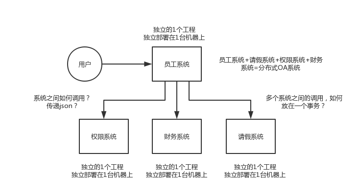

## Distributed System Interview Serial Cannon

Some students used to work in traditional industries or outsourcing projects. They have always been in small companies, and the technology has always been relatively simple. They have a common problem, that is, they have never done distributed systems. Now Internet companies generally do distributed systems. Everyone does not do low-level distributed systems, distributed storage systems Hadoop HDFS, and distributed computing. System Hadoop MapReduce / Spark, distributed streaming computing system Storm.

Distributed business system is to split a large system originally developed with Java into **multiple subsystems**, and multiple subsystems call each other to form a large system as a whole. Suppose you originally made an OA system, which contains a permission module, an employee module, a leave module, and a financial module. A project contains a bunch of modules. The modules will call each other and be deployed on one machine. Now if you disassemble this system, there are 4 systems and 4 projects, namely the authorization system, the employee system, the leave system, and the financial system, which are deployed on 4 machines respectively. A request comes and completes the request. The employee system calls the authorization system, calls the leave system, and calls the financial system. The four systems have completed part of the work. After the last four systems are done, it is considered that the request has been completed. Up.

> Spring Cloud has risen and become popular in recent years. It has just become popular, but it has not yet begun to popularize. Currently, Dubbo is popular, so Dubbo is also the main topic here.

The interviewer may ask you the following questions.

### Why do we need to split the system?

-Why do we need to split the system? How to split the system? Can I not use Dubbo after the split? What is the difference between Dubbo and thrift?

### Distributed Service Framework

-How does Dubbo work? Can the communication be continued after the registration center is hung up?
-What serialization protocols does Dubbo support? Tell me about Hessian's data structure? Does PB know? Why is PB the most efficient?
-What are Dubbo's load balancing strategy and high availability strategy? What about dynamic proxy strategies?
-What is Dubbo's SPI idea?
-How to perform service governance, service degradation, failure retry and timeout retry based on Dubbo?
-How to design the idempotence of the distributed service interface (for example, the deduction cannot be repeated)?
-How to ensure the order of distributed service interface requests?
-How to design an RPC framework similar to Dubbo?

### Distributed lock

-How to design distributed locks using Redis? Is it okay to use zk to design distributed locks? Which of the two implementations of distributed locks is more efficient?

### Distributed transaction

-Do you understand distributed transactions? How do you solve the distributed transaction problem? What should I do if there is a network failure in TCC? How to ensure the consistency of XA?

### Distributed Session

-How to implement distributed sessions during cluster deployment?