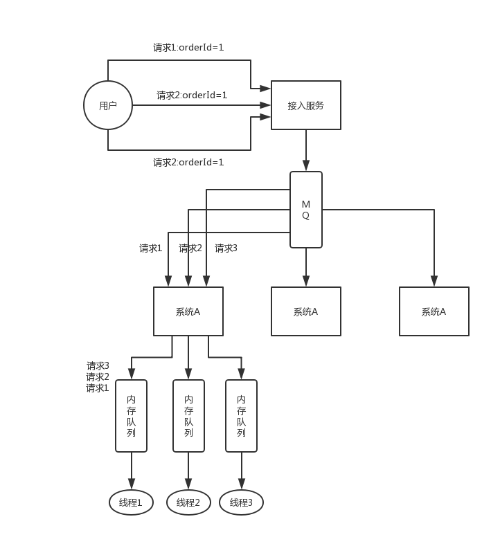

## Interview Questions

How to ensure the order of distributed service interface requests?

## Interviewer psychoanalysis

In fact, the calling sequence of the distributed system interface is also a problem. Generally speaking, the sequence is not guaranteed. But **sometimes** may indeed require **strict order** guarantees. To give you an example, you service A calls service B, insert and then delete. Well, the two requests passed and landed on different machines. Perhaps the insert request was executed slower for some reasons, causing the delete request to be executed first. At this time, because there was no data, there was no effect; as a result, the insert request came over at this time. Now, well, the data is inserted in, then it will be embarrassing.

It should have been "Insert first -> Delete again", this data should be gone, but now "Delete first -> Insert again", the data still exists, and finally you can't figure out what happened.

So these are some very common problems in distributed systems.

## Analysis of Interview Questions

First of all, in general, my personal suggestion is that the system you design from business logic is best to not require such sequential guarantees, because once sequential guarantees are introduced, such as using **distributed locks**, it will* *Causes the system complexity to rise**, and will bring about **low efficiency**, hot data pressure and other problems.

Let me give you a solution we have used. To put it simply, first you have to use Dubbo's consistent hash load balancing strategy to distribute, for example, requests corresponding to a certain order id to a certain machine, and then to that On the machine, because it may be executed concurrently by multiple threads, you may have to immediately throw the request corresponding to a certain order id into a **memory queue** and force the queue to ensure their order.

However, there are many follow-up problems caused by this. For example, what if a certain order corresponds to a very large number of requests, which causes a certain machine to become a **hot spot**? Solving these problems requires a series of follow-up complex technical solutions... Once this type of problem caused us a headache, so, what are the suggestions?

It’s better to say, for example, just now, whether the insert and delete operations of an order can be combined into one operation, that is, a delete, or something else, to avoid this kind of problem.