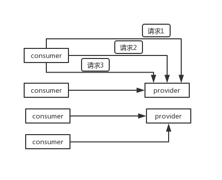

## Interview Questions

What communication protocols does dubbo support? Which serialization protocols are supported? Tell me about Hessian's data structure? Does PB know? Why is PB the most efficient?

## Interviewer psychoanalysis

In the previous question, talk about the basic working principle of dubbo. You must know at least what layers dubbo is divided into, and then how to initiate rpc requests, registration, discovery, and invocation. These are the basics.

Then you can ask in-depth questions about the bottom layer. For example, in the first step, you can ask about the serialization protocol, which is how to go in normal RPC?

## Analysis of Interview Questions

**Serialization** is the process of converting a data structure or some objects into a binary string, and **deserialization** is a process of converting the binary string generated during the serialization process into a data structure or object process.

### dubbo supports different communication protocols

-dubbo protocol `dubbo://`

**Default** is to use the dubbo protocol, a single long connection, and NIO asynchronous communication, based on hessian as the serialization protocol. The scenario used is: the amount of transmitted data is small (each request is within 100kb), but the amount of concurrency is high, and the number of service consumer machines is much greater than the number of service provider machines.

In order to support high-concurrency scenarios, the service provider usually only has a few machines, but there are hundreds of service consumers, and the number of calls may reach hundreds of millions of times a day! At this time, it is most appropriate to use a long connection, that is, to maintain a long connection with each service consumer, there may be a total of 100 connections. Then, the asynchronous communication based on the long connection NIO directly can support high concurrent requests.

A long connection, in layman's terms, means that the request can be sent continuously after the connection is established, without the need to establish a connection.

For short connections, the connection needs to be re-established each time before sending a request.

-rmi protocol `rmi://`

The RMI protocol is implemented using JDK standard java.rmi.\*, using blocking short connections and JDK standard serialization. Multiple short connections are suitable for situations where the number of consumers and providers is similar, suitable for file transmission, and generally less used.

-hessian protocol `hessian://`

The Hessian 1 protocol is used to integrate Hessian's services. The bottom layer of Hessian uses Http communication and uses Servlet to expose services. Dubbo embeds Jetty as a server by default. Take the hessian serialization protocol, multiple short connections, suitable for the case where the number of providers is more than the number of consumers, suitable for file transmission, and generally less used.

-http protocol `http://`

The remote invocation protocol based on HTTP forms is implemented using Spring's HttpInvoker. Take form serialization.

-thrift protocol `thrift://`

The current thrift protocol supported by dubbo is an extension of the thrift native protocol. Some additional header information, such as service name, magic number, etc., are added to the native protocol.

-webservice `webservice://`

The remote call protocol based on WebService is implemented based on the frontend-simple and transports-http of Apache CXF. Take SOAP text serialization.

-memcached protocol `memcached://`

RPC protocol based on memcached implementation.

-redis protocol `redis://`

RPC protocol based on Redis implementation.

-rest protocol `rest://`

REST call support based on the standard Java REST API-JAX-RS 2.0 (short for Java API for RESTful Web Services).

-gPRC protocol `grpc://`

Dubbo has supported the gRPC protocol since version 2.7.5. For developers who plan to use HTTP/2 communication, or who want to use the Stream, backpressure, and Reactive programming capabilities that gRPC brings, they can consider enabling the gRPC protocol.

### Serialization protocol supported by dubbo

dubbo supports multiple serialization protocols such as hession, Java binary serialization, json, SOAP text serialization. But hessian is its default serialization protocol.

### Talk about the data structure of Hessian

Hessian's object serialization mechanism has 8 primitive types:

-Raw binary data
-boolean
-64-bit date (date with a 64-bit millisecond value)
-64-bit double
-32-bit int
-64-bit long
-null
-UTF-8 encoded string

There are also 3 types of recursion:

-list for lists and arrays
-map for maps and dictionaries
-object for objects

There is also a special type:

-ref: used to indicate a reference to a shared object.

### Why is PB the highest efficiency?

In fact, the performance of PB is so good because of two main reasons: **First**, it uses the proto compiler to automatically serialize and deserialize. It is very fast and should be faster than `XML` and `JSON` It's almost `20~100` times; **Second**, its data compression effect is good, which means that the volume of data after serialization is small. Because of its small size, the bandwidth and speed of transmission will be optimized.