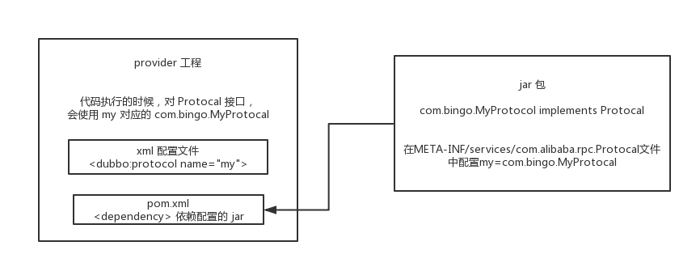

## Interview Questions

What is the spi idea of ​​dubbo?

## Interviewer psychoanalysis

Continue to ask in depth. After I have asked some basic things, I am sure you should be ok and understand some basic things of dubbo. Then ask a slightly more difficult question, which is spi. Let me first ask you what is spi? Then ask how do you realize dubbo's spi?

In fact, it is to see how well you master dubbo.

## Analysis of Interview Questions

### What is spi?

SPI, in simple terms, is `service provider interface`. What does it mean to put it plainly, for example, if you have an interface, and now this interface has three implementation classes, which implementation class should you choose for this interface when the system is running? ? This requires spi, you need to ** find the corresponding implementation class** and load it in according to the specified configuration** or the **default configuration**, and then use the instance object of this implementation class.

Give a chestnut.

You have an interface A. A1/A2/A3 are different implementations of interface A respectively. You configure `interface A = implementation A2`, then when the system is actually running, your configuration will be loaded, and an object will be instantiated to provide services with implementation A2.

Where is the spi mechanism generally used? **Scenario of plug-in extension**, for example, if you develop an open source framework for others to use, if you want others to write a plug-in and plug it into your open source framework to extend a certain function, at this time spi thought Just use it.

### The embodiment of Java spi thought

The classic thinking of spi is used by everyone, such as jdbc.

Java defines a set of jdbc interfaces, but Java does not provide jdbc implementation classes.

But in fact, when the project is running, which implementation classes of the jdbc interface should be used? Generally speaking, we have to **according to the database you use**, such as mysql, you will import `mysql-jdbc-connector.jar`; oracle, you will import `oracle-jdbc-connector.jar` .

When the system is running, if you encounter the interface you use jdbc, it will use the implementation class provided in the jar you introduced at the bottom layer.

### dubbo's spi thought

Dubbo also used the spi idea, but didn't use the spi mechanism of jdk, it was a set of spi mechanism that it realized by itself.

```java
Protocol protocol = ExtensionLoader.getExtensionLoader(Protocol.class).getAdaptiveExtension();
```

Protocol interface. When the system is running, dubbo will determine which implementation class of the Protocol interface should be used to instantiate objects for use.

It will find a Protocol you configured, load the Protocol implementation class you configured into the jvm, and then instantiate the object, just use your Protocol implementation class.

The above line of code is used extensively in dubbo, that is, for many components, one interface and multiple implementations are reserved, and then the corresponding implementation class is dynamically found according to the configuration when the system is running. If you don't configure it, just follow the default implementation, no problem.

```java
@SPI("dubbo")
public interface Protocol {

    int getDefaultPort();

    @Adaptive
    <T> Exporter<T> export(Invoker<T> invoker) throws RpcException;

    @Adaptive
    <T> Invoker<T> refer(Class<T> type, URL url) throws RpcException;

    void destroy();

}
```

In dubbo's own jar, in the `/META_INF/dubbo/internal/com.alibaba.dubbo.rpc.Protocol` file:

```xml
dubbo=com.alibaba.dubbo.rpc.protocol.dubbo.DubboProtocol
http=com.alibaba.dubbo.rpc.protocol.http.HttpProtocol
hessian=com.alibaba.dubbo.rpc.protocol.hessian.HessianProtocol
```

So, this shows how the spi mechanism of dubbo is played by default. It is actually the Protocol interface. What `@SPI("dubbo")` said is that the implementation class is provided through the SPI mechanism, and the implementation class is through dubbo It is found in the configuration file as the default key. The configuration file name is the same as the fully qualified name of the interface. Using dubbo as the key, you can find the default implementation class is `com.alibaba.dubbo.rpc.protocol.dubbo.DubboProtocol`.

If you want to dynamically replace the default implementation class, you need to use the `@Adaptive` interface. In the Protocol interface, two methods are annotated with `@Adaptive`, which means that the two interfaces will be implemented by the proxy.

What do you mean?

For example, this Protocol interface has two `@Adaptive` annotations to annotate methods. When running, proxy classes will be generated for Protocol. There will be proxy codes in the two methods of this proxy class, and the proxy codes will be dynamically based on the url when running. In the protocol to get that key, the default is dubbo, you can also specify it yourself, if you specify another key, then you will get an instance of another implementation class.

### How to extend the components in dubbo by yourself

Let's talk about how to extend the components in dubbo by yourself.

Write a project yourself. If it is a jar package, create a `META-INF/services` in the `src/main/resources` directory and put a file in it called: `com.alibaba.dubbo. rpc.Protocol`, make a `my=com.bingo.MyProtocol` in the file. Get the jar into the nexus private server by yourself.

Then build a `dubbo provider` project by yourself, rely on the jar you built in this project, and then configure it in the spring configuration file:

```xml
<dubbo:protocol name=”my” port=”20000” />
```

When the provider starts, it will be loaded into the configuration line of `my=com.bingo.MyProtocol` in our jar package, and then the MyProtocol that you defined will be used according to your configuration. This is just a brief explanation. You pass The above method can replace a large number of internal components of dubbo, that is, throw your own jar package and configure it.



Dubbo provides a large number of extension points similar to the above, that is, if you want to extend something, just write a jar yourself, let your consumer or provider project depend on your jar, and specify the directory in your jar Configure the file corresponding to the interface name, and pass `key=implementation class` in it.

Then for the corresponding component, similar to `<dubbo:protocol>`, use the implementation class corresponding to your key to implement an interface. You can extend various functions of dubbo by yourself and provide your own implementation.