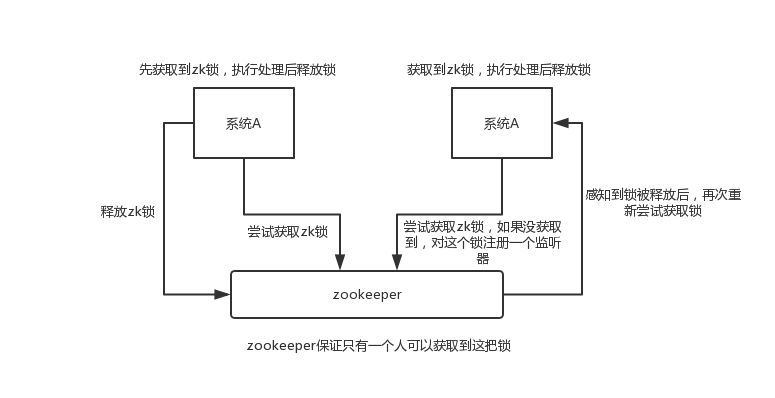
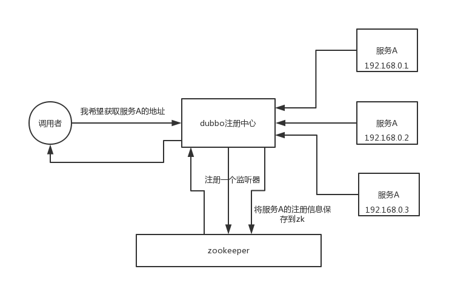

## Interview Questions

What are the usage scenarios for zookeeper?

## Interviewer psychoanalysis

The topic we are talking about now is a distributed system. After the interviewer has talked with you about some dubbo-related questions, he has confirmed that you have a basic understanding of the distributed service framework/RPC framework. Then he may start to talk to you about other distributed-related issues.

Distributed locks are very commonly used. If you are doing Java system development, distributed systems, there may be some scenarios where you will use it. The most commonly used distributed lock is implemented based on zookeeper.

In fact, to be honest, to ask this question is to see if you know zookeeper, because zookeeper is a very common basic system in distributed systems. And when you ask, what is the usage scenario of zookeeper? See if you know some basic usage scenarios. But in fact, if zookeeper digs deep, it is natural to ask very deeply.

## Analysis of Interview Questions

Roughly speaking, the usage scenarios of zookeeper are as follows, I will give a few simple ones, everyone can say just a few:

-Distributed coordination
-Distributed lock
-Metadata/configuration information management
-HA high availability

### Distributed coordination

This is actually a very classic usage of zookeeper. Simply put, it is like, your A system sends a request to mq, and then the B system message is processed after consumption. How does system A know the processing result of system B? With zookeeper, the coordination between distributed systems can be realized. After sending the request, system A can register a listener for the value of a certain node on zookeeper. Once system B has processed it, modify the value of that node of zookeeper, system A can immediately receive the notification, which is a perfect solution.

### Distributed lock

Give a chestnut. Two consecutive modification operations are issued to a certain data, and the two machines receive the request at the same time, but only one machine can execute the other machine before executing it. Then you can use the zookeeper distributed lock at this time. After a machine receives the request, first obtains a distributed lock on the zookeeper, that is, you can create a znode and then perform the operation; then another machine **try to create* *The znode, it turns out that I can't create it, because it was created by someone else, so I can only wait and execute it after the first machine has finished executing it.

### Metadata/Configuration Information Management

Zookeeper can be used to manage the configuration information of many systems. For example, many distributed systems such as kafka, storm, etc. will use zookeeper to manage some metadata and configuration information. Does the dubbo registry also support zookeeper?

### HA High Availability

This should be very common. For example, many big data systems such as hadoop, hdfs, yarn, etc., choose to develop HA high availability mechanism based on zookeeper, that is, a **important process generally will be active and standby**. The main process hangs immediately. The switch to the standby process is sensed through zookeeper.

