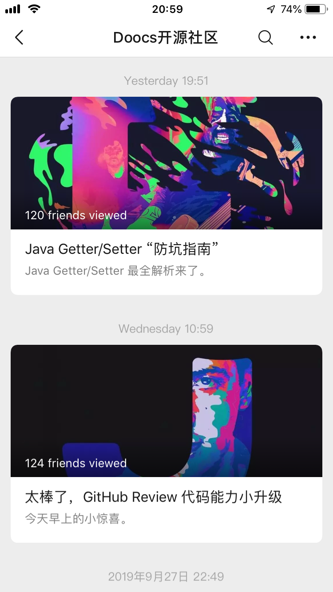
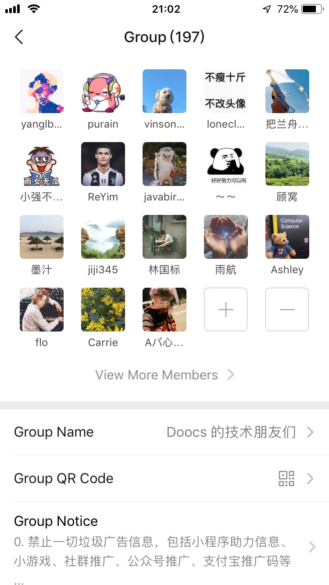

# Doocs The official account of the open source community is here

GitHub Open Source Community Doocs’s only official account "**Doocs Open Source Community**" focuses on mining IT technical knowledge and helping developers grow.

   

Come and become the first fans of the official account? It will certainly not disappoint your expectations.

## Why choose an official account?

The **original protection function** of the WeChat official account is better, and the content is more convenient to read.

All subsequent original articles of mine will be published on the WeChat public account "Doocs Open Source Community" as soon as possible. If other official account owners want to reprint the content, please send a message to explain to me at the official account chat window, or directly add my personal WeChat (YLB0109) to communicate.

## What is the positioning of the official account?

-**High-quality content**: Do not copy and paste some articles from the Internet at will, even if it is a reprinted technical article, you must ensure the quality.
-**Regular update**: Try to output 1-2 articles per week to ensure a certain update frequency.

  

## What articles are there currently?

Because the official account has just been launched, there are currently the following articles, let's take a look:

-[Hardcore! Million-level traffic spike system design](https://mp.weixin.qq.com/s/Mo_knIRBQQL2s-D2aieZLg)
-[Does the technical interview require interviews? The interviewer/interviewer has something to say! ](https://mp.weixin.qq.com/s/fNiUmbY395rsPdEC0QDIrw)
-[How to crack the JiYi sliding verification code? The success rate is 100%! ](https://mp.weixin.qq.com/s/Fsl6qYN5Dw4s6Du893MkFQ)
-[A free and easy-to-use picture bed, just you, "picture shell"! ](https://mp.weixin.qq.com/s/0HhgHLo_tTRFZcC-CVjDbw)
-[Ali another 20k+ stars open source project is born, congratulations fastjson! ](https://mp.weixin.qq.com/s/RNKDCK2KoyeuMeEs6GUrow)
-[Remove 90% of Candidates’ Internet Big Data Interview Questions (with solution + method summary)](https://mp.weixin.qq.com/s/rjGqxUvrEqJNlo09GrT1Dw)
-[Easy to use! How does the long-awaited text block feature work in Java 13? ](https://mp.weixin.qq.com/s/kalGv5T8AZGxTnLHr2wDsA)
-[The 2019 GitHub Open Source Contribution Rankings are freshly released! Microsoft Google leads, Ali ranks among the top 12! ](https://mp.weixin.qq.com/s/_q812aGD1b9QvZ2WFI0Qgw)
-[How does the real-time auto-completion function of Google search "work"? ](https://mp.weixin.qq.com/s/YlMISSc3Sn890BzTLytcLA)
-[Awesome, it turns out that Redisson is so easy to use! ](https://mp.weixin.qq.com/s/lpZ7eRdImy0MyTEVH68HYw)
-[An article takes you to understand the "caching strategy"](https://mp.weixin.qq.com/s/47A_iXY_nArURwUTPHr2IQ)
-[Java Getter/Setter "Guide to Anti-pit"](https://mp.weixin.qq.com/s/TZqcAw7NTlcvU-p930-eHA)
-[Great, small upgrade of GitHub Review code capability](https://mp.weixin.qq.com/s/Lok0epqn91Q51ygZo_FLkg)
-[Use Redis Hyperloglog to easily count UV data](https://mp.weixin.qq.com/s/w1r-M6YVvQSfUtzO_xe44Q)
-[How to open the "GitHub+Code Cloud" dual workflow mode? ](https://mp.weixin.qq.com/s/byxAjr3-ifWfDYQcR7YA8Q)

A series of original dry goods articles will be launched in the follow-up, so stay tuned.

## Is there an exchange group?

Yes, there are currently close to 200 people in the WeChat group "**Doocs Technical Friends**". If you want to join, please contact me via WeChat.

**Note**, all spam advertising information is prohibited in the group, including small program help information, small games, community promotion, official account promotion, Alipay promotion code, etc.; exchange GitHub, development-related, and you can freely share some development-related knowledge, But it is not advocating the whole day water group, it is recommended to spend more time to improve yourself.

  

