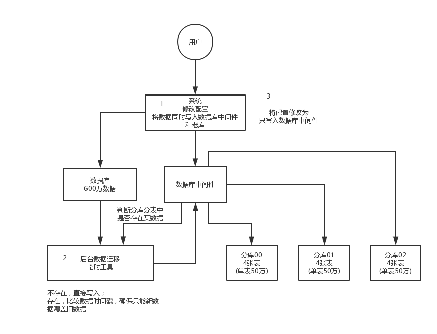

## Interview Questions

Now there is a system that is not divided into databases and tables. In the future, it will be divided into tables and tables. How to design so that the system can be dynamically switched from the database and table to the table in the database?

## Interviewer psychoanalysis

Take a look, you now understand why you need to sub-database and sub-table, you also know the commonly used sub-database and sub-table middleware, and you have also designed your plan for how to sub-database and sub-table (horizontal split, vertical split) Sub-database and sub-table), the question is, how do you then migrate your single-database and single-meter system to sub-database and sub-table?

So this is all one link after another, it depends on whether you have gone through this process in the whole process.

## Analysis of Interview Questions

Actually, there are several schemes from low to tall. We have all played, and I will tell you about them all.

### Downtime migration plan

Let me first tell you the lowest solution, which is very simple. The big guy starts operation and maintenance at 12 o'clock in the morning, and an announcement is made on the website or app, saying that the operation and maintenance will be carried out from 0 o'clock in the morning to 6 o'clock in the morning and cannot be accessed.

Then it stops at 0 o'clock, the system stops, and no traffic is written. At this time, the old single-database single-table database is static. Then you have to write a one-time tool for derivatives before, and then run directly, and then read out the data of the single database and single table, and write it into the sub-database and sub-table.

After the derivative is finished, it is ok. Modify the database connection configuration of the system, including possible code and SQL. If there is a modification, then you can use the latest code, and then directly start the connection to the new sub-database and sub-table.

Verify it, ok, perfect, everyone stretch your waist, take a look at the night view of Beijing at 4 o'clock in the morning, and go home.

But this plan is relatively low and anyone can do it. Let's take a look at the taller plan.

### Dual Write Migration Scheme

This is a commonly used migration plan, which is more reliable, no downtime, no need to watch the scenery of Beijing at 4 o'clock in the morning.

Simply put, in the online system, all the places where the library was written before, the addition, deletion and modification operations, except for the addition, deletion and modification of the old library, the addition, deletion and modification of the new library are added, which is the so-called **double writing **, write two libraries at the same time, the old library and the new library.

Then after **system deployment**, the data of the new database is too far away. Use the derivative tool mentioned before to run to read the data of the old database and write to the new database. When writing, you must judge the last modification time of this data according to the fields of gmt_modified. , Unless the read data is not in the new library, or it is newer than the new library data will be written. Simply put, it is not allowed to overwrite new data with old data.

After a round of guidance, there may still be inconsistencies in the data, then the program will automatically perform a round of verification, compare each data in each table of the new and old libraries, and then if there are differences, focus on those differences. Read data from the old library and write again. Repeatedly loop until the data in each table of the two libraries are exactly the same.

Then when the data is completely consistent, it is ok. Based on the latest code using only the sub-database and sub-table, redeploy once, not just based on the sub-database and sub-table in operation, there is no downtime for several hours, and it is very stable. . So now it's basically playing data migration and so on.

