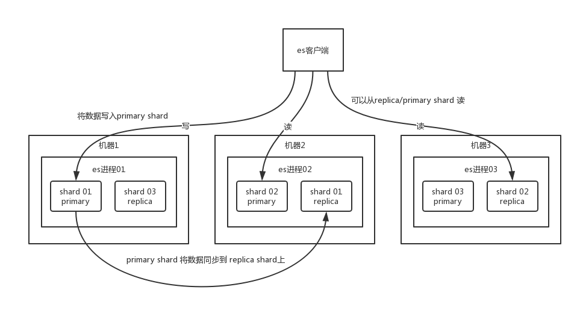

## Interview Questions

Can you talk about the principle of ES's distributed architecture (how does ES realize distributed architecture)?

## Interviewer psychoanalysis

In search, Lucene is the most popular search library. A few years ago, the industry generally asked, do you know lucene? Do you know the principle of inverted index? It's already out now, because many projects now directly use Lucene-based distributed search engine-ElasticSearch, referred to as ES.

And now distributed search has basically become the standard configuration of most Java systems in the Internet industry, of which ES is particularly popular. When ES was not popular in the past few years, everyone generally used solr. However, in the past two years, most companies and projects have begun to switch to ES.

Therefore, Internet interviews will definitely talk about distributed search engines with you, and will definitely talk about ES. If you really don't know, then you are really out.

If the interviewer asks you the first question, they will generally ask you, can you introduce the distributed architecture design of ES? Just look at your basic understanding of distributed search engine architecture.

## Analysis of Interview Questions

ElasticSearch is designed to be a distributed search engine, and the bottom layer is actually based on lucene. The core idea is to start multiple ES process instances on multiple machines to form an ES cluster.

The **basic unit for storing data in ES is an index**. For example, if you want to store some order data in ES now, you should create an index `order_idx` in ES, and all order data will be written to this index Inside, an index is almost equivalent to a table in mysql.

```
index -> type -> mapping -> document -> field
```

Well, in order to make a more straightforward introduction, I will make an analogy here. But remember, don’t draw an equal sign, the analogy is just for ease of understanding.

index is equivalent to a table in mysql. The type cannot be compared with mysql. There can be multiple types in an index. The fields of each type are the same, but there are some slight differences. Suppose there is an index, which is an order index, which contains order data. It's like you are building a table in mysql. Some orders are orders for physical goods, such as a piece of clothing or a pair of shoes; some orders are orders for virtual goods, such as game card and phone bill recharge. For the two orders, most of the fields are the same, but a few fields may be slightly different.

Therefore, two types will be created in the order index. One is the physical product order type and the other is the virtual product order type. Most of the fields of these two types are the same, and a few of the fields are different.

In many cases, there may be one type in an index, but if it is true that there are multiple types in an index (**Note**, the concept of `mapping types` has been completely removed in ElasticSearch 7. X. For detailed instructions, please refer to [Official Documents](https://github.com/elastic/elasticsearch/blob/6.5/docs/reference/mapping/removal_of_types.asciidoc)). You can think that index is a category of tables, each specific A type represents a table in mysql. Each type has a mapping. If you think a type is a specific table, index represents the same type of multiple types, and mapping is the table structure definition of this type. You create one in mysql The table must define the structure of the table, which fields are in it, and what type of each field is. In fact, you write a piece of data in a type in the index, called a document. A document represents a row in a table in mysql. Each document has multiple fields, and each field represents the document. The value of one of the fields.


If you create an index, this index can be split into multiple shards, and each shard stores part of the data. Splitting multiple shards is beneficial. One is **support horizontal expansion**. For example, if your data volume is 3T, 3 shards, each shard is 1T data, if the data volume now increases to 4T, how to expand? It's very simple. Rebuild an index with 4 shards and import the data; the second is to **improve performance**, the data is distributed across multiple shards, that is, multiple servers, and all operations will be performed on multiple machines Parallel and distributed execution improves throughput and performance.

Then the data of this shard actually has multiple backups, that is, each shard has a primary shard, responsible for writing data, but there are also several replica shards. After the `primary shard` writes data, it will synchronize the data to several other `replica shards`.



Through this replica solution, each shard's data has multiple backups. If a machine goes down, it doesn't matter, there are other data copies on other machines. High availability now.

Multiple nodes in the ES cluster will automatically elect one node as the master node. This master node is actually doing some management tasks, such as maintaining index metadata, and being responsible for switching the identities of primary shard and replica shard. If the master node goes down, a new node will be elected as the master node.

If the non-master node is down, the master node will transfer the identity of the primary shard on that down node to the replica shard on other machines. Then if you repair the down machine, after restarting, the master node will control the distribution of the missing replica shards, synchronize subsequent modified data and so on, so that the cluster will return to normal.

To put it more simply, it means if a non-master node goes down. Then the primary shard on this node is not gone. Well, the master will make the replica shard corresponding to the primary shard (on other machines) switch to the primary shard. If the down machine is repaired, the repaired node will no longer be the primary shard, but the replica shard.

In fact, the above is the most basic architecture design of ElasticSearch as a distributed search engine.