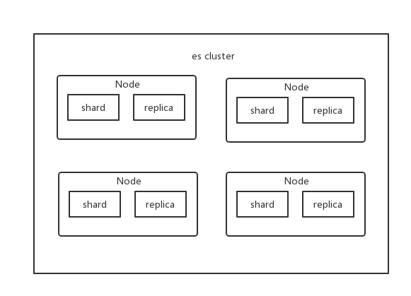

## The past and present of Lucene and ES

Lucene is the most advanced and powerful search library. If you develop directly based on Lucene, it is very complicated. Even if you write some simple functions, you have to write a lot of Java code, and you need to understand the principles in depth.

ElasticSearch is based on Lucene, hides the complexity of Lucene, and provides a simple and easy-to-use RESTful api / Java api interface (there are also api interfaces in other languages).

-Distributed document storage engine
-Distributed search engine and analysis engine
-Distributed, supporting PB-level data

## The core concept of ES

### Near Realtime

Near real time, there are two meanings:

-There is a small delay from when data is written to when data can be searched (about 1s)
-Search and analysis based on ES can reach the second level

### Cluster

A cluster contains multiple nodes, and which cluster each node belongs to is determined by a configuration. For small and medium-sized applications, it is normal for a cluster to have one node at the beginning.

### Node

Node is a node in the cluster, and the node also has a name, which is randomly assigned by default. The default node will join a cluster named `elasticsearch`. If you start a bunch of nodes directly, they will automatically form an elasticsearch cluster. Of course, a node can also form an elasticsearch cluster.

### Document & field

A document is the smallest data unit in ES. A document can be a piece of customer data, a piece of product classification data, and a piece of order data. It is usually represented by a json data structure. Each type under index can store multiple documents. There are multiple fields in a document, and each field is a data field.

```json
{
  "product_id": "1",
  "product_name": "iPhone X",
  "product_desc": "Apple phone",
  "category_id": "2",
  "category_name": "Electronic Products"
}
```

### Index

The index contains a bunch of document data with a similar structure, such as a commodity index. An index contains many documents, and an index represents a type of similar or identical ducument.

### Type

Type. Each index can have one or more types. Type is a logical classification of index. For example, there are multiple types under the commodity index: daily chemical commodity type, electrical commodity type, and fresh commodity type. The field of the document under each type may be different.

### shard

A single machine cannot store a large amount of data. ES can divide the data in an index into multiple shards and distribute them on multiple servers for storage. With a shard, you can scale horizontally, store more data, and distribute search and analysis operations to multiple servers for execution, improving throughput and performance. Each shard is a lucene index.

### replica

Any server may fail or go down at any time, and the shard may be lost at this time, so multiple replica copies can be created for each shard. Replica can provide backup services when the shard fails to ensure that data is not lost. Multiple replicas can also improve the throughput and performance of search operations. Primary shard (set once during index creation, cannot be modified, the default is 5), replica shard (modify the number at any time, the default is 1), the default is 10 shards for each index, 5 primary shards, 5 replica shards, the smallest height Available configuration is 2 servers.

Let's put it this way, shards are divided into primary shard and replica shard. The primary shard is generally referred to as shard, and the replica shard is generally referred to as replica.



## ES core concept vs. DB core concept

| ES | DB |
| -------- | -------- |
| index | Database |
| type | Data Sheet |
| document | One row of data |

The above is a simple analogy.