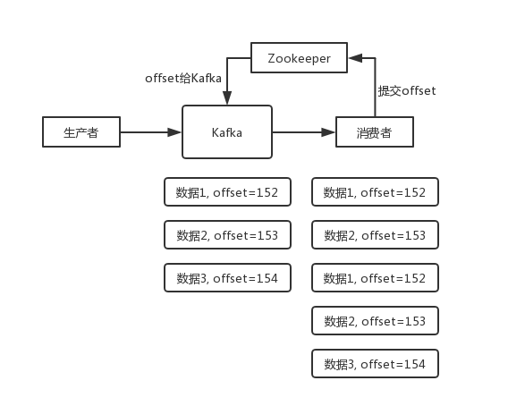

## Interview Questions

How to ensure that messages are not re-consumed? In other words, how to ensure the idempotence of message consumption?

## Interviewer psychoanalysis

In fact, this is a very common question, these two questions can basically be asked together. Since it is consumer news, we must consider whether it will be repeated consumption? Can you avoid repeated consumption? Or is it okay not to cause system abnormalities even after repeated consumption? This is a basic question in the MQ field. In fact, it is essentially asking you how to use message queues to ensure idempotence. This is a question to be considered in your architecture.

## Analysis of Interview Questions

To answer this question, first of all, don't hear the repeated news, just don't know anything. You** first talk about the possible problems of repeated consumption**.

First of all, such as RabbitMQ, RocketMQ, Kafka, there may be repeated consumption of messages, which is normal. Because this problem is usually not guaranteed by MQ itself, but by our development. Pick a Kafka as an example, and talk about how to repeat consumption.

Kafka actually has an offset concept, that is, every message is written in, there is an offset, which represents the serial number of the message, and then after the consumer consumes the data, it will consume itself **every time** (regularly scheduled) Submit the offset of the past message, saying "I have already consumed it. If I restart or something next time, please let me continue to consume from the offset I consumed last time."

But there are always surprises in everything. For example, what we often encountered in production before is that you sometimes restart the system to see how you restart. If you encounter something anxious, just kill the process and restart it. This will cause the consumer to process some messages, but there is no time to submit the offset, which is embarrassing. After restarting, a few messages will be consumed again.

Give a chestnut.

There is such a scene. Data 1/2/3 enter Kafka in turn. Kafka will assign an offset to each of these three pieces of data, representing the serial number of this piece of data. We assume that the assigned offset is 152/153/154 in turn. When consumers consume from Kafka, they also consume in this order. Suppose when the consumer consumes this piece of data with `offset=153`, and just prepares to submit the offset to Zookeeper, the consumer process is restarted at this time. Then the offset of 1/2 of the consumed data is not submitted at this time, and Kafka does not know that you have consumed the data of `offset=153`. Then after the restart, the consumer will find Kafka and say, hey, buddy, you will continue to pass me the data behind the place I consumed last time. Since the previous offset was not submitted successfully, the data 1/2 will be transmitted again. If the consumer does not de-duplicate at this time, it will lead to repeated consumption.

Note: The new version of Kafka has transferred the offset storage from Zookeeper to Kafka brokers, and uses the internal displacement topic `__consumer_offsets` for storage.

If consumers take a piece of data and write one into the database, it will lead to saying that you may have inserted data 1/2 into the database twice, then the data is wrong.

In fact, repeated consumption is not terrible. The terrible thing is that you don’t consider how to ensure idempotence after repeated consumption.

Let me give you an example. Suppose you have a system that inserts one piece of data into the database when one message is consumed. If you repeat one message twice, you insert two pieces. Isn't the data wrong? But if you consume it for the second time, judge for yourself whether you have already consumed it. If so, just throw it away, so that a piece of data is not retained, thus ensuring the correctness of the data.

If a piece of data is repeated twice, there is only one piece of data in the database, which ensures the idempotence of the system.

Idempotence, in layman's terms, just one data or one request is repeated many times for you, and you have to make sure that the corresponding data will not change and **cannot make mistakes**.

So the second question is, how to ensure the idempotence of message queue consumption?

In fact, we still have to think about the business. Here are a few ideas:

-For example, if you take a piece of data to write to the database, you first check it based on the primary key. If the data is all there, don’t insert it, just update it.
-For example, if you write Redis, that's okay. Anyway, it is set every time, which is naturally idempotent.
-For example, if you are not in the above two scenarios, it is a little more complicated. When you need to let the producer send each piece of data, add a globally unique id, similar to the order id, and then you will consume it here , First check it in Redis, for example, according to this id, have you consumed it before? If you haven't consumed it, you just deal with it, and then this id is written in Redis. If you have consumed it, don't process it, and make sure not to process the same message repeatedly.
-For example, based on the unique key of the database to ensure that duplicate data will not be inserted repeatedly. Because of the unique key constraint, repeated data insertion will only report errors and will not cause dirty data in the database.

Of course, how to ensure that the consumption of MQ is idempotent requires a specific business perspective.