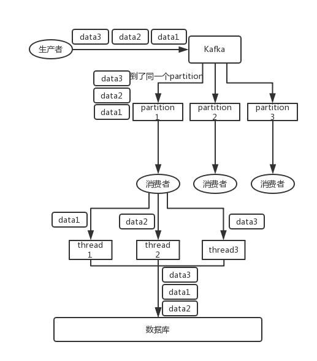

## Interview Questions

How to ensure the order of messages?

## Interviewer psychoanalysis

In fact, this is also a topic that must be asked when using MQ. First, do you understand the order? Second, see if you have any way to ensure that the messages are in order? This is a common problem in production systems.

## Analysis of Interview Questions

Let me give an example. We have done a mysql `binlog` synchronization system before, and the pressure is still very high. The daily synchronization data has to reach hundreds of millions, which means that the data is synchronized from one mysql library to another mysql library intact. Go (mysql -> mysql). A common point is that, for example, a big data team needs to synchronize a mysql library to perform various complex operations on the data of the company's business system.

You add, delete, or modify a piece of data in mysql, which corresponds to the addition, deletion, and modification of 3 `binlog` logs, and then these three `binlog`s are sent to MQ, and then consumed and executed in sequence. At least you must ensure that they come in order, right? Otherwise, it was originally: add, modify, delete; you just changed the order and executed it into delete, modify, add, isn't it all wrong.

Originally, this data was synchronized, and the last data should be deleted; as a result, you made a mistake in the order, and finally the data was retained, and the data synchronization went wrong.

Let's take a look at two scenarios where the order will be out of order:

-**RabbitMQ**: One queue, multiple consumers. For example, the producer sends three pieces of data to RabbitMQ, the order is data1/data2/data3, and what is pressed is a memory queue of RabbitMQ. There are three consumers who consume one of the three pieces of data from MQ. As a result, consumer 2 finishes the operation first, saves data2 in the database, and then data1/data3. This is not obviously messed up.

-**Kafka**: For example, we have built a topic with three partitions. When the producer writes, he can actually specify a key. For example, if we specify an order id as the key, then the data related to this order will be distributed to the same partition, and the data in this partition must be There is an order.  When consumers retrieve data from the partition, there must be an order. Up to this point, the order is still ok, there is no confusion. Then, we may engage in multiple threads to process messages concurrently in the consumer. Because if the consumer is single-threaded consumption processing, and the processing is relatively time-consuming, for example, processing a message takes tens of ms, then only tens of messages can be processed per second, which is too low throughput. If multiple threads run concurrently, the order may be messed up.

### solution

#### RabbitMQ

Split multiple queues. Each queue has a consumer, which means that there are more queues. This is really troublesome; or there is only one queue but corresponding to one consumer, and then this consumer uses the internal memory queue as a queue, and then distributes it to different workers at the bottom. deal with.

#### Kafka

-One topic, one partition, one consumer, internal single-thread consumption, single-thread throughput is too low, generally will not use this.
-Write N memory queues, and data with the same key will be sent to the same memory queue; then for N threads, each thread consumes one memory queue, so that the order can be guaranteed.

