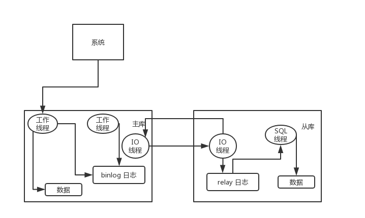

## Interview Questions

Have you done MySQL separation of reads and writes? How to realize the separation of reading and writing in MySQL? What is the principle of MySQL master-slave replication? How to solve the delay problem of MySQL master-slave synchronization?

## Interviewer psychoanalysis

At this stage of high concurrency, reading and writing must be separated. What do you mean? Because in fact, most Internet companies, some websites, or apps, actually read more and write less. Therefore, in response to this situation, it is to write a master library, but the master library hangs multiple slave libraries, and then reads from multiple slave libraries, can't it support higher read concurrency pressure?

## Analysis of Interview Questions

### How to realize MySQL's read-write separation?

In fact, it is very simple. It is based on the master-slave replication architecture. Simply put, we build a master library and hang multiple slave libraries. Then we just write the master library, and then the master library will automatically synchronize the data to the slave libraries.

### What is the principle of MySQL master-slave replication?

The main library writes the changes into the binlog log, and then after connecting from the library to the main library, the slave library has an IO thread that copies the binlog log of the main library to its local area and writes it to a relay relay log. Then there is a SQL thread from the library that reads the binlog from the relay log, and then executes the content in the binlog log, that is, executes the SQL again locally, so that you can ensure that the data in the main library is the same.



There is a very important point here, that is, the process of synchronizing data from the main library from the library is serialized, that is to say, parallel operations on the main library will be executed serially on the slave library. So this is a very important point. Due to the characteristics of the slave library copying logs from the main library and executing SQL serially, in high concurrency scenarios, the data of the slave library will definitely be slower than the main library, because there is a delay. **of. Therefore, it often appears that the data just written into the main library may not be read, and it may take tens of milliseconds or even hundreds of milliseconds to read it.

And there is another problem here, that is, if the main library suddenly goes down and the data happens to not be synchronized to the slave library, then some data may not be available on the slave library, and some data may be lost.

So MySQL actually has two mechanisms in this area, one is **semi-synchronous replication**, which is used to solve the problem of data loss in the main database; the other is **parallel replication**, which is used to solve the problem of master-slave synchronization delay.

This so-called **semi-synchronous replication**, also called `semi-sync` replication, means that after the master database writes the binlog log, it will **force** immediately to synchronize the data to the slave database. After writing the log to its own local relay log, it will return an ack to the main library, and the main library will consider the write operation to be completed after receiving **at least one ack from the slave**.

The so-called **parallel replication** refers to opening multiple threads from the library, reading the logs of different libraries in the relay log in parallel, and then **replaying the logs of different libraries in parallel**, which is library-level parallelism.

### MySQL master-slave synchronization delay problem (essence)

In the past, online bugs that were caused by the delay of master-slave synchronization were indeed handled online, which belonged to small-scale production accidents.

This is the scene. A classmate wrote code logic like this. Insert a piece of data first, find it out, and then update this piece of data. In the peak period of the production environment, the write concurrency reached 2000/s. At this time, the master-slave replication delay was probably less than tens of milliseconds. Online will find that there is always some data every day. We expect to update some important data status, but it is not updated during the peak period. The user will give feedback to the customer service, and the customer service will give us feedback.

We pass the MySQL command:

```sql
show slave status
```

Looking at `Seconds_Behind_Master`, you can see that the data copied from the master library is a few ms behind.

Generally speaking, if the master-slave delay is more serious, there are the following solutions:

-Sub-library, split a main library into multiple main libraries, the write concurrency of each main library is reduced several times, and the master-slave delay can be ignored at this time.
-Turn on parallel replication supported by MySQL, and replicate multiple libraries in parallel. If the write concurrency of a certain library is extremely high, and the write concurrency of a single library reaches 2000/s, parallel replication is still meaningless.
-Students who rewrite the code and write the code should be cautious, and the query may not be found immediately when inserting the data.
-If it does exist, it must be inserted first, and the query will be found immediately upon request, and then some operations will be performed in reverse immediately. For this query, set up direct connection to the main database. **Not recommended** This method, if you do this, the meaning of separation of reading and writing will be lost.