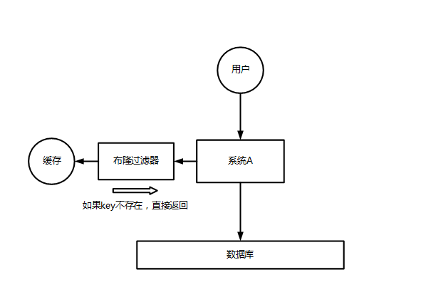

## Interview Questions

Understand what is the avalanche, penetration and breakdown of Redis? What happens after Redis crashes? How should the system respond to this situation? How to deal with Redis penetration?

## Interviewer psychoanalysis

In fact, this is a must to ask about the cache, because cache avalanche and penetration are the two biggest problems of the cache, or it does not appear, once it appears, it is a fatal problem, so the interviewer will definitely ask you.

## Analysis of Interview Questions

### Cache Avalanche

For system A, suppose that there are 5000 requests per second during the daily peak period. The cache can handle 4000 requests per second during the peak period, but the cache machine unexpectedly goes down. The cache is down. At this time, all 5,000 requests per second fall into the database. The database will not be able to handle it. It will report an alarm and then hang. At this point, if there is no special solution to deal with this failure, the DBA is very anxious and restarts the database, but the database is immediately killed by the new traffic.

This is the cache avalanche.

About 3 years ago, a relatively well-known Internet company in China caused an avalanche due to a caching accident, and all the back-end systems crashed. The accident lasted from the afternoon to 3 to 4 in the evening, and the company lost tens of millions.

The pre-event and post-event solutions for the cache avalanche are as follows:

-Beforehand: Redis high availability, master-slave + sentinel, Redis cluster, to avoid total crash.
-In the event: local ehcache cache + hystrix current limit & downgrade to prevent MySQL from being killed.
-After the event: Redis persists. Once restarted, data is automatically loaded from the disk to quickly restore cached data.

The user sends a request. After system A receives the request, it will first check the local ehcache cache, and then check Redis if it is not found. If neither ehcache nor Redis exists, check the database again, and write the results in the database to ehcache and Redis.

For the current limiting component, you can set the number of requests per second, how many can pass the component, and the remaining unpassed requests, what should I do? **Go downgrade**! You can return some default values, or friendly prompts, or empty values.

benefit:

-The database will never die, and the current limiting component ensures that only how many requests per second can pass.
-As long as the database is not dead, that is to say, for users, 2/5 of the requests can be processed.
-As long as 2/5 of the requests can be processed, it means that your system is not dead. For users, the page may not be displayed after a few clicks, but the page can be displayed after a few more clicks.

### Cache penetration

For system A, assuming 5000 requests per second, 4000 requests are malicious attacks issued by hackers.

The 4000 attacks issued by hackers cannot be found in the cache, and every time you go to the database to check them, you can't find them either.

Give a chestnut. The database id starts from 1. As a result, the request id sent by the hacker is all negative. In this case, it will not be in the cache, and every time the request is "**see the cache as nothing**", the database is directly queried. The cache penetration of this malicious attack scenario will directly kill the database.

The solution is very simple. Every time System A does not find it in the database, it writes a null value to the cache, such as `set -999 UNKNOWN`. Then set an expiration time, so that when the same key is accessed next time, the data can be directly retrieved from the cache before the cache expires.

Of course, if a hacker uses a different negative id each time to attack, the method of writing a null value may not work. A more common approach is to add a Bloom filter before caching, and hash all possible data in the database to the Bloom filter. Then make the following judgments for each request:

-The key of the requested data does not exist in the Bloom filter, it can be determined that the data will not exist in the database, and the system can immediately return that it does not exist.
-If the key of the requested data exists in the Bloom filter, it will continue to query the cache again.

The use of bloom filters can play a certain role in the preliminary screening of access requests, avoiding the query pressure caused by the absence of data.

### Cache breakdown

Cache breakdown means that a certain key is very hot, frequently accessed, and is in a situation of centralized high concurrent access. When the key becomes invalid, a large number of requests break through the cache and directly request the database, as if A hole was cut in a barrier.

The solution in different scenarios can be as follows:

-If the cached data is basically not updated, you can try to set the hotspot data to never expire.
-If the cached data is not updated frequently and the entire process of cache refreshing takes less time, you can use distributed mutexes based on distributed middleware such as Redis and zookeeper, or local mutexes to ensure that only A small number of requests can request the database and rebuild the cache, and the remaining threads can access the new cache after the lock is released.
-If the cached data is updated frequently or the cache refreshing process takes a long time, the timing thread can be used to actively rebuild the cache before the cache expires or delay the expiration time of the cache to ensure that all requests can be accessed all the time To the corresponding cache.