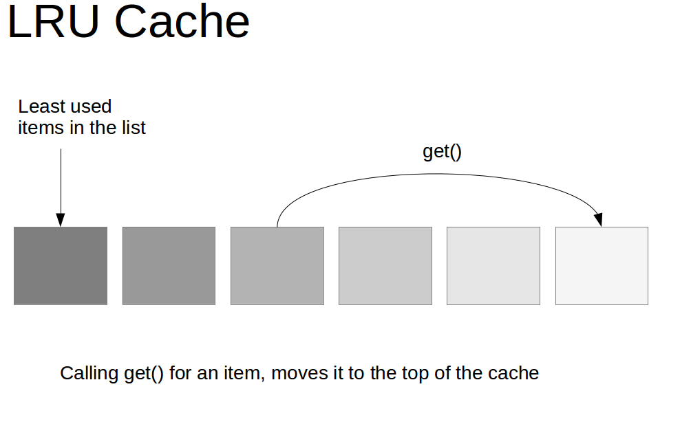

## Interview Questions

What are the expiration strategies of Redis? What are the memory elimination mechanisms? Write the LRU code by hand?

## Interviewer psychoanalysis

If you don’t even know this question, you are confused when you come up and can’t answer, then when you write code online, you take it for granted that the data written into Redis will definitely exist, which will cause various bugs in the system later, who will be responsible ?

There are two common problems:

-Why is the data written to Redis gone?

Some students may encounter that Redis in the production environment often loses some data, write it in, and it may disappear after a while. My goodness, classmate, if you ask this question, it means you are useless with Redis. Redis is a cache, you should store it, right?

What is cache? Use memory as a cache. Is memory unlimited? Memory is precious and limited. Disks are cheap and large. A machine may have dozens of gigabytes of memory, but it can have several gigabytes of hard disk space. Redis is mainly based on memory for high-performance, high-concurrency read and write operations.

Since the memory is limited, for example, Redis can only use 10G, what if you write 20G of data in it? Of course, the 10G data will be killed, and then the 10G data will be retained. What data will be killed? What data is kept? Of course, get rid of the infrequently used data and keep the frequently used data.

-The data is obviously expired, why is it still occupying memory?

This is determined by Redis's expiration policy.

## Analysis of Interview Questions

### Redis expiration policy

The Redis expiration strategy is: **Regular deletion + Lazy deletion**.

The so-called **periodic deletion** means that by default, Redis randomly extracts some keys with an expiration time every 100ms, checks whether they expire, and deletes them if they expire.

Suppose that there are 10w keys in Redis, and the expiration time is set. If you check 10w keys every few hundred milliseconds, then Redis will basically die, the CPU load will be very high, and the consumption will be consumed by your checking expired keys. On it. Note that here is not to traverse all the keys that set the expiration time every 100ms, that would be a performance disaster. In fact, Redis **randomly extracts** some keys every 100ms to check and delete.

But the problem is that regular deletion may cause many expired keys to not be deleted when the time is up. What about the whole thing? So it is lazy deletion. That is to say, when you get a key, Redis will check, if the key is set with an expiration time, does it expire? If it expires, it will be deleted and nothing will be returned to you.

> When the key is obtained, if the key has expired at this time, it will be deleted and nothing will be returned.

But in fact, this is still a problem. If you delete a lot of expired keys on a regular basis, and then you don’t check it in time, you don’t go through the lazy deletion. What will happen at this time? If a large number of expired keys accumulate in the memory, causing the Redis memory block to be exhausted, how can it be done?

The answer is: **take the memory elimination mechanism**.

### Memory elimination mechanism

Redis memory elimination mechanisms are as follows:

-noeviction: When the memory is not enough to hold the newly written data, the new write operation will report an error. Generally no one uses this. It is really disgusting.
-**allkeys-lru**: When the memory is insufficient to accommodate the newly written data, in the **key space**, remove the least recently used key (this is the most commonly used).
-allkeys-random: When the memory is not enough to accommodate the newly written data, a key is randomly removed in the **key space**. This is generally no one uses it. Why is it random? It must be the least recently used Kill the key.
-Volatile-lru: When the memory is insufficient to accommodate the newly written data, remove the least recently used key in the key space with the expiration time set (this is generally not appropriate).
-Volatile-random: When the memory is not enough to hold the newly written data, in the key space with the expiration time set, a key is randomly removed.
-Volatile-ttl: When the memory is insufficient to accommodate the newly written data, in the key space with the expiration time set **, the key with the expiration time ** earlier will be removed first.

### Handwriting an LRU algorithm

LRU is the abbreviation of Least Recently Used, which translates as "least recently used". In other words, the LRU algorithm will remove the least recently used cache and give it to the newly used cache. And it is often the most frequently read, that is, the most read, so by making good use of the LRU algorithm, we can provide the efficiency of caching hot data and improve the memory usage of the cache service.

So how to achieve it?

In fact, the idea of ​​realization is very simple, as described in the picture below.



You can hand-write the most primitive LRU algorithm on the spot. The amount of code is too large and it seems unrealistic.

Do not ask yourself to create your own LRU from the bottom by hand, but at least you need to know how to use the existing JDK data structure to implement a Java version of LRU.


```java
public class LRUCache<K, V> extends LinkedHashMap<K, V> {
    private int capacity;

    /**
     * How much data can be cached at most when passed in
     *
     * @param capacity cache size
     */
    public LRUCache(int capacity) {
        super(capacity, 0.75f, true);
        this.capacity = capacity;
    }

    /**
     * If the amount of data in the map is greater than the set maximum capacity, return true, and delete the oldest data when adding a new object
     *
     * @param eldest the oldest data item
     * @return true removes the oldest data
     */
    @Override
    protected boolean removeEldestEntry(Map.Entry<K, V> eldest) {
        // When the amount of data in the map is greater than the specified number of caches, the oldest data is automatically removed
        return size()> capacity;
    }
}
```